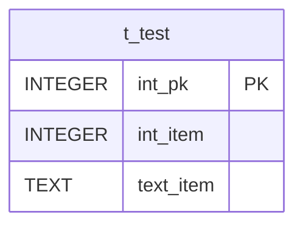

## はじめに

SQLite3のコマンドラインツールにはCSVファイルのインポート機能が備わっており，下記のようにしてインポートを行うことができる．

```
sqlite3 test.db '.import --csv t_test.csv t_test'
```

CSVファイルのインポートに際しては，基本的に全てTEXT型で扱われるが，テーブルが既に定義されているのであれば，インポート先の列に合わせて型変換が行われる．

しかし，空データはNULLではなく空文字列扱いであるため，INTEGER型やREAL型のような非TEXT型の列に取り込むとき，

- 非STRICTテーブルであれば空文字列として登録
- STRICTテーブルであればインポートエラー

となってしまう．

本記事ではこの問題を解決する方法を示す．

なお，この記事で挙げる例では

- DBファイル: test.db
- CSVファイル: t_test.csv
- 取り込み先テーブル: `t_test`

とし， `t_test` は下記の定義とする．

```sql
CREATE TABLE t_test (
  int_pk INTEGER NOT NULL,
  int_item INTEGER,
  text_item TEXT,
  PRIMARY KEY (int_pk)
);
```



また，CSVファイルは下記の内容とする．

```csv
1,10,apple
2,,banana
3,30,
```

## 方法1: 後にUPDATE

空文字列として取り込まれるのは仕方ないとして，後にUPDATEをかける手法である．
ただし，前述のようにSTRICTテーブルの非TEXT型には空項目の取り込みができない問題は抱えている．

```bash
sqlite3 test.db << __EOF__
.import --csv t_test.csv t_test

UPDATE t_test
SET
  int_item = NULLIF(int_item, ''),
  text_item = NULLIF(text_item, ''),
WHERE
  int_item = ''
  OR text_item = ''
;
__EOF__
```

## 方法2: 一時テーブルに取り込んだ後INSERT

一旦CSVファイルを全てTEXT型の一時テーブルに取り込んだ後，その一時テーブルから目的のテーブルに対してINSERTを行う手法である．
この手法であれば，STRICTテーブルに対してもCSVデータのインポートが可能になる．

元のDBファイルは汚したくないので，オンメモリの別DBに一時ファイルを作成するようにする．
`CREATE TEMPORARY TABLE` で一時テーブルを作成するのもアリではあるが，別DBとして切り出すことで，別スキーマに全く同一のテーブル名で一時テーブルを作成することが可能になるし，元のDBファイルでの他テーブルとの名前の衝突の可能性を一切気にしなくて済む．

```
sqlite3 test.db << __EOF__
ATTACH DATABASE ':memory:' AS imp;

CREATE TABLE imp.t_test (
  int_pk TEXT,
  int_item TEXT,
  text_item TEXT
)

BEGIN;

.import --csv --schema imp t_test.csv t_test

INSERT t_test (
  int_pk,
  int_item,
  text_item
)
SELECT
  NULLIF(int_pk, '') AS int_pk,
  CAST(NULLIF(int_item, ''), INTEGER) AS int_item,
  NULLIF(text_item, '') AS text_item
FROM
  imp.t_test
;

COMMIT;
__EOF__
```


一時テーブルに対して主キーを設定することもできるが，とりあえず制約なくCSVを取り込んでおき，INSERT時に主キー重複エラーが発生したときには，再度上記インポート手順にて，一時テーブルをオンメモリではなく別のDBファイルに作成するようにする．
こうすれば，CSVファイル内のどのデータに問題があるか，CSVファイルに目を凝らすことなくSQLで調査することが可能になる．

## 方法2の改善

方法2が万全な方法ではあるが， CREATE TABLE 文と INSERT 文を元のテーブルに合わせて記述するのが面倒である．

SQLite3においては `pragma_table_info()` 関数でテーブルの情報が取得可能であり，どちらもインポート先のテーブルがあれば自動生成できる．
それを踏まえたbashスクリプトを作成すると下記のようになる．

```sh:sqlite3_csvimport.sh
#!/bin/sh

set -eu

sqlite3='sqlite3'
tempdb=':memory:'
import_schema='imp'

if [ $# -ne 2 -a $# -ne 3 ]; then
  cat << __EOF__ >&2
Invaliad arguments.
[USAGE]
  $0 {OPTIONS...} DBFILE CSVFILE {TABLENAME}
__EOF__
  exit 1
fi

dbfile="$1"
csv="$2"
if [ -z "${3:-}" ]; then
  tblname=${2##*/}
  tblname=${tblname%.*}
else
  tblname="$3"
fi

if "${sqlite3}" "${dbfile}" "SELECT 1 FROM "${tblname}" LIMIT 1" > /dev/null 2>&1; then
  # Aggregate columns.
  cols=$("${sqlite3}" "${dbfile}" << __EOF__
SELECT
  STRING_AGG('"' || name || '"', ', ' ORDER BY cid) AS concat_cols
FROM
  pragma_table_info('${tblname}')
;
__EOF__
)

  # Aggregate columns for CREATE TABLE statement.
  cols_for_create=$("${sqlite3}" "${dbfile}" << __EOF__
SELECT
  STRING_AGG('"' || name || '" TEXT', ', ' ORDER BY cid) AS concat_cols
FROM
  pragma_table_info('${tblname}')
;
__EOF__
)

  # Aggregate columns for SELECT part in INSERT statement.
  cols_for_select=$("${sqlite3}" "${dbfile}" << __EOF__
SELECT
  STRING_AGG(
    CASE
      WHEN UPPER(type) LIKE '%INT%' OR (type NOT LIKE '%TEXT%' AND type NOT LIKE '%CHAR%' AND type NOT LIKE '%CLOB%')
        THEN 'CAST(NULLIF(' || name || ', '''') AS ' || type || ')'
      WHEN "notnull" = 0 AND pk = 0
        THEN 'NULLIF(' || name || ', '''')'
      ELSE
        name
      END || ' AS ' || name,
    ', ' ORDER BY cid) AS concat_cols_for_select
FROM
  pragma_table_info('${tblname}')
__EOF__
)

  "${sqlite3}" "${dbfile}" << __EOF__
.bail on
ATTACH DATABASE '${tempdb}' AS ${import_schema};
BEGIN;
CREATE TABLE ${import_schema}."${tblname}" (${cols_for_create});
.import --csv --schema ${import_schema} '${csv}' "${tblname}"
INSERT INTO "${tblname}" (${cols}) SELECT ${cols_for_select} FROM ${import_schema}."${tblname}";
COMMIT;
__EOF__

else
  "${sqlite3}" "${dbfile}" << __EOF__
.bail on
.import --csv ${csv} "${tblname}"
__EOF__
fi
```

空文字列のINTEGER型やREAL型へのキャストは成功してしまうため，非TEXT型であれば `NULLIF()` は通さなければならない．

```sql
SELECT CAST('' AS INTEGER);  -- -> 0
SELECT CAST('' AS REAL);  -- -> 0.0
```

また，インポート先の列がTEXT型であっても，NOT NULLであれば `NULLIF()` 関数は通さず，空文字列として登録するようにしている．
まとめると下記の表のとおりとなる．

| インポート先の型 | NOT NULL | 要NULLIF？ | 要CAST？ |
|-|:-:|:-:|:-:|
| TEXT | ○ | | |
| TEXT | | ○ | |
| 非TEXT | ○ | ○ | ○ |
| 非TEXT | | ○ | ○ |

このスクリプトは下記のように用いる．

```
./sqlite3_csvimport.sh test.db t_test.csv t_test
```

このときに生成され，実行されるSQLは下記のとおりである．
列名をダブルクオートで囲んでいるのは， notnull のような予約語や マルチバイト文字等，通常は列名に用いることができない名前をカバーするためである．

```sql
INSERT INTO "t_test" (
  "int_pk",
  "int_item",
  "text_item"
)
SELECT
  CAST(NULLIF("int_pk", '') AS INTEGER) AS "int_pk",
  CAST(NULLIF("int_item", '') AS INTEGER) AS "int_item",
  NULLIF("text_item", '') AS "text_item"
FROM
  imp."t_test"
;
```

## さらなる改善

CSVのインポートはそのままINSERTによる取り込みだけであって，主キー重複があると取り込みができない．
一時テーブルを作成するのだから，UPSERTを初めとし，事前削除やUPDATEのみ行うことも可能であるので，それらの機能も付け加えてみた．

```sh:sqlite3_csvimport.sh
#!/bin/sh

set -eu

import_schema='imp'

##
## Show help text of this script.
##
## stdout: Help text of this program.
## stderr: Nothing
##
show_help() {
  cat << __EOF__
[USAGE]
  $0 {OPTIONS...} DBFILE CSVFILE {TABLENAME}
[OPTIONS]
  -a, --analyze
    Do ANALYZE after import.
  -c SQLITE3_CMD, --command=SQLITE3_CMD
    Specify SQLite3 command.
    DEFAULT VALUE: sqlite3
  -d, --delete
    DELETE all records from target table before importing.
  -h, --help
    Show help and exit program.
  -r, --reindex
    Do REINDEX after import.
  -s N, --skip=N
    Specify the number of header lines to skip.
  -t DBFILE, --temporary-database=DBFILE
    Specify temporary database name.
    DEFAULT VALUE: :memory:
  -u, --upsert
    Do INSERT/UPDATE instead of INSERT.
  -U, --update
    Do UPDATE instead of INSERT.
  -v, --verbose
    Show verbose messages.
  -V, --vacuum
    Do VACUUM after import.
__EOF__
}

unset GETOPT_COMPATIBLE
opt=$(getopt -o 'ac:dhrs:t:uUvV' -l 'analyze,command;,delete,help,reindex,skip,temporary-database:,update,upsert,verbose,vacuum' -- "$@")
eval set -- "${opt}"

while [ $# -gt 0 ]; do
  case "$1" in
    '-a' | '--analyze')
      do_analyze=1
      ;;
    '-c' | '--command')
      sqlite3="$2"
      ;;
    '-d' | '--delete')
      mode='delete'
      ;;
    '-h' | '--help')
      show_help
      exit 0
      ;;
    '-r' | '--reindex')
      do_reindex=1
      ;;
    '-s' | '--skip')
      if [ "$2" -eq 0 ]; then
        unset opt_skip
      else
        opt_skip="--skip $2"
      fi
      ;;
    '-t' | '--temporary-database')
      tempdb="$2"
      ;;
    '-u' | '--upsert')
      mode='upsert'
      ;;
    '-U' | '--update')
      mode='update'
      ;;
    '-v' | '--verbose')
      opt_verbose='-v'
      ;;
    '-V' | '--vacuum')
      do_vacuum=1
      ;;
    --)
      shift
      break
      ;;
  esac
  shift
done

if [ $# -ne 2 -a $# -ne 3 ]; then
  echo 'Invalid arguments.' >&2
  show_help >&2
  exit 1
fi

dbfile="$1"
csv="$2"
if [ -z "${3:-}" ]; then
  tblname=${2##*/}
  tblname=${tblname%.*}
else
  tblname="$3"
fi

[ -z "${sqlite3:-}" ] && sqlite3='sqlite3' || :
[ -z "${tempdb:-}" ] && tempdb=':memory:' || :

if "${sqlite3}" "${dbfile}" "SELECT 1 FROM "${tblname}" LIMIT 1" > /dev/null 2>&1; then
  # Aggregate columns.
  cols=$("${sqlite3}" "${dbfile}" << __EOF__
SELECT
  STRING_AGG('"' || name || '"', ', ' ORDER BY cid) AS concat_cols
FROM
  pragma_table_info('${tblname}')
;
__EOF__
)

  # Aggregate columns for CREATE TABLE statement.
  cols_for_create=$("${sqlite3}" "${dbfile}" << __EOF__
SELECT
  STRING_AGG('"' || name || '" TEXT', ', ' ORDER BY cid) AS concat_cols
FROM
  pragma_table_info('${tblname}')
;
__EOF__
)

  # Aggregate columns for SELECT part in INSERT statement.
  cols_for_select=$("${sqlite3}" "${dbfile}" << __EOF__
SELECT
  STRING_AGG(
    CASE
      WHEN UPPER(type) LIKE '%INT%' OR (type NOT LIKE '%TEXT%' AND type NOT LIKE '%CHAR%' AND type NOT LIKE '%CLOB%')
        THEN 'CAST(NULLIF("' || name || '", '''') AS ' || type || ')'
      WHEN "notnull" = 0 AND pk = 0
        THEN 'NULLIF("' || name || '", '''')'
      ELSE
        '"' || name || '"'
      END || ' AS "' || name || '"',
    ', ' ORDER BY cid) AS concat_cols_for_select
FROM
  pragma_table_info('${tblname}')
;
__EOF__
)

  if [ "${mode:-}" = 'upsert' ]; then
    # Aggregate primary key columns for ON CONFLICT clause in INSERT statement.
    cols_pk=$("${sqlite3}" "${dbfile}" << __EOF__
SELECT
  STRING_AGG('"' || name || '"', ', ' ORDER BY cid) AS concat_cols
FROM
  pragma_table_info('${tblname}')
WHERE
  pk = 1
;
__EOF__
)
    if [ -n "${cols_pk}" ]; then
      # Aggregate non-primary key columns for UPDATE part in INSERT statement (UPSERT).
      cols_update=$("${sqlite3}" "${dbfile}" << __EOF__
SELECT
  STRING_AGG('"' || name || '" = EXCLUDED."' || name || '"', ', ' ORDER BY cid) AS concat_cols
FROM
  pragma_table_info('${tblname}')
WHERE
  pk = 0
;
__EOF__
)
      if [ -n "${cols_update}" ]; then
        # Aggregate primary key columns for WHERE clause in UPDATE part in INSERT statement (UPSERT).
        cond_where=$("${sqlite3}" "${dbfile}" << __EOF__
SELECT
  STRING_AGG('"' || name || '" IS DISTINCT FROM EXCLUDED."' || name || '"', ' OR ' ORDER BY cid) AS concat_cols
FROM
  pragma_table_info('${tblname}')
WHERE
  pk = 0
;
__EOF__
)
        upsert_part=" WHERE TRUE ON CONFLICT (${cols_pk}) DO UPDATE SET ${cols_update} WHERE ${cond_where}"
      fi
    fi
  elif [ "${mode:-}" = 'delete' ]; then
    stmt_delete="DELETE FROM \"${tblname}\";"
  fi

  if [ "${mode:-}" = 'update' ]; then
    if [ "${tblname}" = 't' -o "${tblname}" = 'T' ]; then
      alias_imptbl='t2'
    else
      alias_imptbl='t'
    fi

    # Aggregate non-primary key columns for SET clause in UPDATE statement.
    cols_set=$("${sqlite3}" "${dbfile}" << __EOF__
SELECT
  STRING_AGG('"' || name || '" = ${alias_imptbl}."' || name || '"', ', ' ORDER BY cid) AS concat_cols
FROM
  pragma_table_info('${tblname}')
WHERE
  pk = 0
;
__EOF__
)
    if [ -z "${cols_set}" ]; then
      echo 'Cannot import CSV on UPDATE mode for the table without non primary key rows' >&2
      exit 2
    fi

    # Aggregate primary key columns for WHERE clause in UPDATE statement to check primary key equivalents.
    cond_where=$("${sqlite3}" "${dbfile}" << __EOF__
SELECT
  STRING_AGG('"${tblname}"."' || name || '" = ' || '${alias_imptbl}."' || name || '"', ' AND ' ORDER BY cid) AS concat_cols
FROM
  pragma_table_info('${tblname}')
WHERE
  pk = 1
;
__EOF__
)
    if [ -z "${cond_where}" ]; then
      echo 'Cannot import CSV on UPDATE mode for the table without primary key' >&2
      exit 3
    fi

    # Aggregate non-primary key columns for WHERE clause in UPDATE statement to check non-primary key differences.
    cond_where_diff=$("${sqlite3}" "${dbfile}" << __EOF__
SELECT
  STRING_AGG('"${tblname}"."' || name || '" IS DISTINCT FROM ${alias_imptbl}."' || name || '"', ' OR ' ORDER BY cid) AS concat_cols
FROM
  pragma_table_info('${tblname}')
WHERE
  pk = 0
;
__EOF__
)
    stmt_insert_or_update="UPDATE \"${tblname}\" SET ${cols_set} FROM (SELECT ${cols_for_select} FROM ${import_schema}.\"${tblname}\") ${alias_imptbl} WHERE ${cond_where} AND (${cond_where_diff});"
  else
    stmt_insert_or_update="INSERT INTO \"${tblname}\" (${cols}) SELECT ${cols_for_select} FROM ${import_schema}.\"${tblname}\"${upsert_part:-};"
  fi

  [ -f "${tempdb:-}" ] && rm -f "${tempdb:-}" || :

  "${sqlite3}" "${dbfile}" << __EOF__
${opt_verbose:+.echo on}
.bail on
ATTACH DATABASE '${tempdb:-:memory:}' AS ${import_schema};
BEGIN;
CREATE TABLE ${import_schema}."${tblname}" (${cols_for_create});
.import --csv --schema ${import_schema} ${opt_skip:-} ${opt_verbose:-} '${csv}' "${tblname}"
${opt_verbose:+.changes on}
${stmt_delete:-}
${stmt_insert_or_update}
COMMIT; ${do_reindex:+"REINDEX \"${tblname}\";"} ${do_vacuum:+VACUUM;} ${do_analyze:+"ANALYZE \"${tblname}\""}
__EOF__

else
  if [ "${mode:-}" = 'update' ]; then
    echo 'Cannot import CSV on UPDATE mode for non-existing table' >&2
    exit 4
  fi
  if [ "${mode:-}" = 'delete' ]; then
    echo 'Meaningless DELETE mode for non-existing table' >&2
  fi

  "${sqlite3}" "${dbfile}" << __EOF__
.bail on
${opt_verbose:+.echo on}
${opt_verbose:+.changes on}
.import --csv ${opt_skip:-} ${opt_verbose:-} ${csv} "${tblname}"
${do_reindex:+"REINDEX \"${tblname}\";"} ${do_vacuum:+VACUUM;} ${do_analyze:+"ANALYZE \"${tblname}\""}
__EOF__
fi
```

いくつかオプションを実装しており，それぞれ下記のとおり．

| ショートオプション | ロングオプション | 機能 |
|-|-|-|
| `-a` | `--analyze` | CSVインポート後にそのテーブルにANALYZEを実施する． |
| `-c` | `--command` | 使用するSQLite3コマンドを指定する．パスが通っていない場合やパスが通っていても別のSQLite3を用いたい場合などに用いる想定． |
| `-d` | `--delete` | インポートに先立って，取り込み先のテーブルのレコードを全て削除する． |
| `-h` | `--help` | スクリプトの使用方法を表示して終了する． |
| `-r` | `--reindex` | CSVインポート後にそのテーブルにREINDEXを実施する． |
| `-s` | `--skip` | CSVファイルの読み飛ばす行数を指定する． |
| `-t` | `--temporary-database` | 一時テーブルのファイル名を指定する．デバッグ用． |
| `-u` | `--upsert` | UPSERTでインポートを行う． |
| `-U` | `--update` | UPDATEでインポートを行う． |
| `-v` | `--verbose` | 詳細なメッセージを表示する．デバッグ用． |
| `-V` | `--vacuum` | CSVインポート後にDB全体のVACUUMを実施する． |

### UPSERTモード

オプション `-u` または `--upsert` の指定でUPSERTを行う動作となる．
生成・実行されるINSERT文は下記のとおり．

```sql
INSERT INTO "t_test" (
  "int_pk",
  "int_item",
  "text_item"
)
SELECT
  CAST(NULLIF("int_pk", '') AS INTEGER) AS "int_pk",
  CAST(NULLIF("int_item", '') AS INTEGER) AS "int_item",
  NULLIF("text_item", '') AS "text_item"
FROM
  imp."t_test"
WHERE TRUE
ON CONFLICT ("int_pk")
DO UPDATE
SET
  "int_item" = EXCLUDED."int_item",
  "text_item" = EXCLUDED."text_item"
WHERE
  "int_item" IS NOT EXCLUDED."int_item"
  OR "text_item" IS NOT EXCLUDED."text_item"
;
```


`IS NOT` 演算子はPostgreSQLなどのRDBMSの `IS DISTINCT FROM` 演算子と同じ機能であり，NULLも考慮した等値比較を行う．
近年のSQLite3でも `IS DISTINCT FROM` 演算子はサポートされているが， `IS NOT` の方が文字数が少ないことと，SQLite3に絞った話であるため， `IS NOT` を用いるようにした．

PostgreSQLのUPSERTと異なり，SQLite3ではON CONFLICT句の前，INSERT文に対するWHERE句は必須であるため， `WHERE TRUE` のように常に真の条件をあえて指定している．

### UPDATEモード

オプション `-U` または `--update` の指定でUPDATEを行う動作となる．
生成・実行されるUPDATE文は下記のとおり．

```sql
UPDATE "t_test"
SET
  "int_item" = t."int_item",
  "text_item" = t."text_item"
FROM
  (
    SELECT
      CAST(NULLIF("int_pk", '') AS INTEGER) AS "int_pk",
      CAST(NULLIF("int_item", '') AS INTEGER) AS "int_item",
      NULLIF("text_item", '') AS "text_item"
    FROM
      imp."t_test"
  ) t
WHERE
  "t_test"."int_pk" = t."int_pk"
  AND (
    "t_test"."int_item" IS NOT t."int_item"
    OR "t_test"."text_item" IS NOT t."text_item"
  )
;
```


### DELETEモード

事前にインポート対象のテーブルのDELETEを行ってからINSERTを行う．
SQLite3にはTRUNCATE文がないため，DELETE文での削除となる．

生成・実行されるDELETE文とINSERT文は下記のとおり．
INSERT文については通常のモードのものと差異はない．

```sql
DELETE FROM "t_test";

INSERT INTO "t_test" (
  "int_pk",
  "int_item",
  "text_item"
)
SELECT
  CAST(NULLIF("int_pk", '') AS INTEGER) AS "int_pk",
  CAST(NULLIF("int_item", '') AS INTEGER) AS "int_item",
  NULLIF("text_item", '') AS "text_item"
FROM
  imp."t_test"
;
```


一度テーブルを削除するため，CSVファイルに含まれないデータを除去することができる．

コメントを含むDDL自体は

```sql
SELECT sql FROM sqlite_schema WHERE tbl_name = 't_test';
```

で取得できる（インデックスやトリガーも）ので，データ量によっては一度DROP TABLEしてから，再度CREATE TABLEし，INSERTしてもよいのかもしれない．

## 参考文献

- [Command Line Shell For SQLite](https://sqlite.org/cli.html#importing_files_as_csv_or_other_formats "Command Line Shell For SQLite")
- [The Schema Table](https://sqlite.org/schematab.html "The Schema Table")
- [Pragma statements supported by SQLite](https://www.sqlite.org/pragma.html#pragma_table_info "Pragma statements supported by SQLite")
